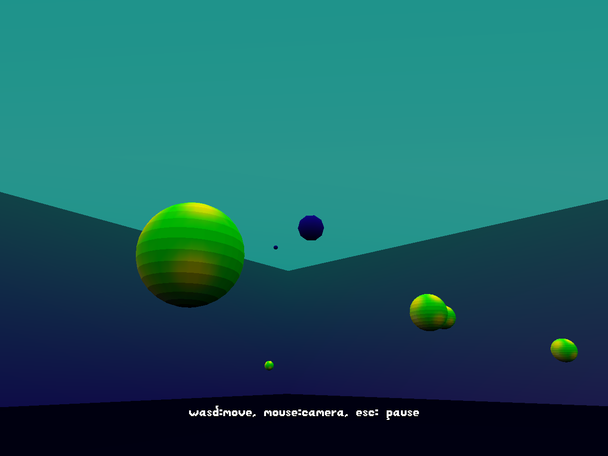

# Bubble 3D

Author: Benjamin Huang

Design: It's the classic game Bubble Trouble, but now in 3D. Sorry it's kinda barebones. Lots of extra room for improvement.

Screen Shot:

How To Play:

WASD to move, left mouse button to shoot. Mouse to control camera. Esc to pause. Backspace to restart level.

Shoot all the bubbles until they are cleared. Bubbles split into smaller bubbles.

Sources: self, and the gp19 font assets

This game was built with [NEST](NEST.md).
